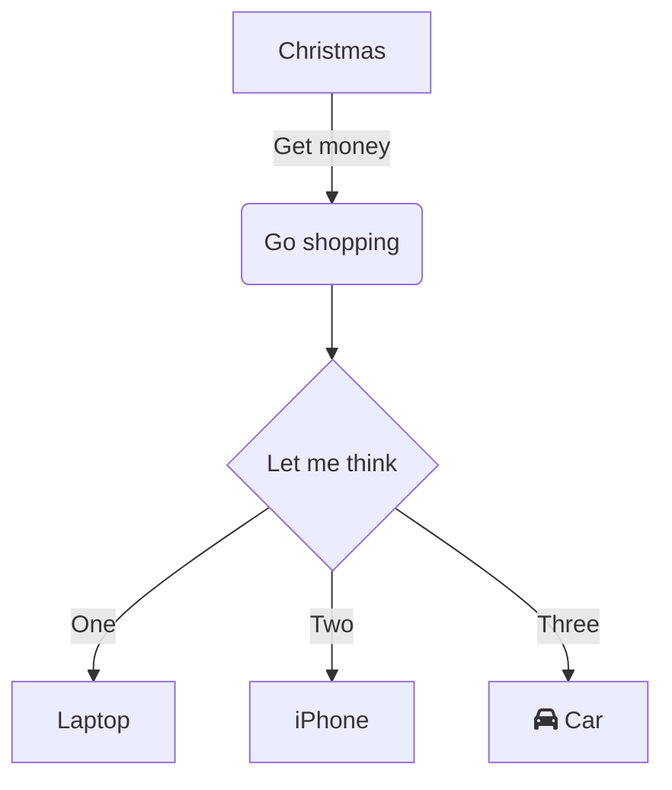
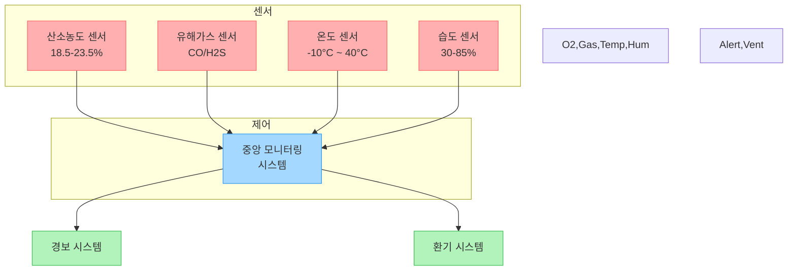

- [x] 나스 솔루션 link, source 백업하기 ✅ 2025-01-09

 Yesterday: [[다울 2025-01-08]] 
 Tomorrow: [[다울 2025-01-10]] 


## 오늘 작업 목표


## Not done yet

```dataviewjs

dv.taskList(dv.pages('-"3. Resource/Templates"').file.tasks

.where(t => !t.completed && !t.text.includes("@frank") &&

!t.text.includes("#task")

))

```

---

## 배운 것

[[temp/2차 작성중|2차 작성중]]
[[../noGitSync/2차 제안서 중간완성]]




## 정리가 필요한 메모는 아래에




